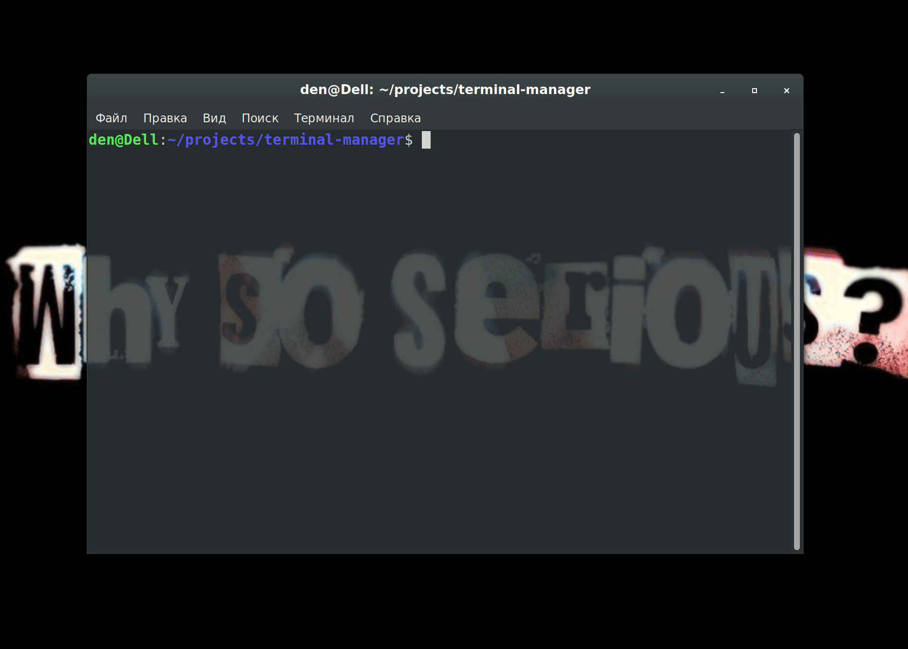

# Terminal manager

## Stack

- [Electron](https://electronjs.org/)
- [Xterm.js](https://xtermjs.org/)
- [SSH2](https://www.npmjs.com/package/ssh2/)
- [Photon](http://photonkit.com/)
- [AlertifyJS](https://alertifyjs.com/) & [Micromodal.js](https://micromodal.now.sh/)
- [Yup](https://www.npmjs.com/package/yup/)
- HTML / CSS / JS

## TODO
- [x] Add terminal statuses
- [x] `conn.exec('uptime')` for example _(See console)_
- [ ] cpu params (free memory, etc.)
- [x] Reset params for the terminal _(Remove and Create new)_
- [ ] Deploy sample
- [ ] Save settings to localStorage
- [ ] Get data from locaStorage and set to app state

### `yarn start`
Production mode start.

### `yarn dev`
Development mode start.

## Demo

## [example-electron-xterm-ssh2](https://github.com/MyXterm/example-electron-xterm-ssh2) based
Just an example to demonstrate electron + xterm + ssh2
